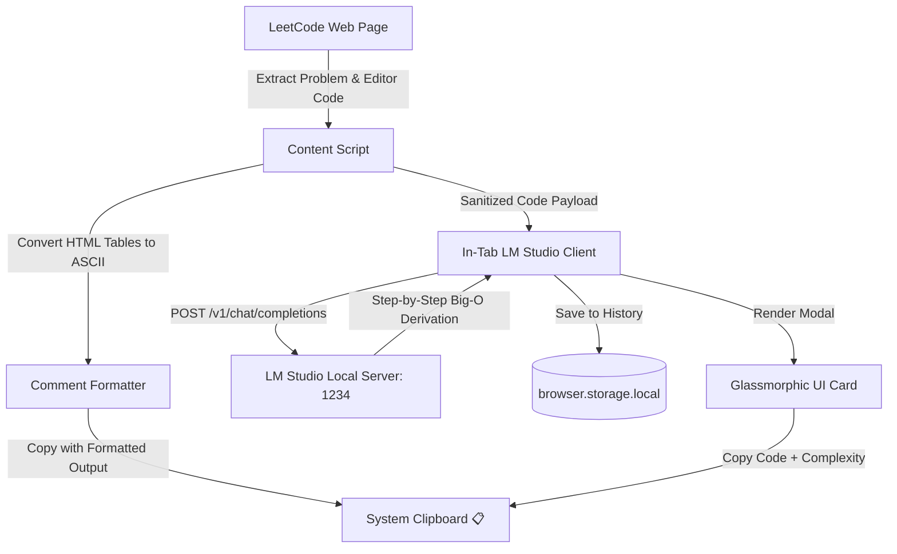

# LeetCode Problem Copier & AI Complexity Analyzer 📋⚡

<p align="center">
  
</p>

<p align="center">
  <strong>The ultimate browser extension for competitive programmers and software engineers.</strong><br>
  Copy formatted LeetCode problem descriptions, starter code, and instant <strong>Local AI Big-O Complexity Analysis</strong> (powered by LM Studio) directly to your clipboard in 1-click.
</p>

<p align="center">
  <a href="https://github.com/punitr2007/Leetcode-Copier/releases"></a>
  <a href="https://addons.mozilla.org/firefox/addon/leetcode-copier/"></a>
  <a href="https://developer.chrome.com/docs/extensions/mv3/intro/"></a>
  <a href="https://lmstudio.ai/"></a>
  <a href="LICENSE"></a>
  <a href="https://github.com/punitr2007/Leetcode-Copier/actions"></a>
</p>

---

## 🌟 Why LeetCode Problem Copier?

When solving LeetCode problems in your local IDE (VS Code, Neovim, JetBrains, etc.), manually copying the problem description, test cases, and starter code while converting everything into formatted comments is tedious and repetitive.

**LeetCode Problem Copier** automates this entirely and supercharges your workflow with **private, offline AI algorithmic analysis**:

1. **📋 1-Click Code & Problem Copying**: Formats descriptions, constraints, examples, and HTML tables into clean ASCII diagrams commented according to your selected programming language (`#`, `//`, `;`, `--`, etc.).
2. **⚡ Local LLM Complexity Engine**: Calculates accurate **Time & Space Complexity ($O(N)$)** using your local LLM (e.g. `Qwen2.5-Coder`, `DeepSeek-Coder`, `Llama 3.2`) running in **LM Studio** — **100% private, zero token costs, and 0 latency roundtrips**.
3. **🧠 Step-by-Step Mathematical Derivation**: Breakdowns for sorting, nested loops, recursion stacks, and auxiliary data structures.
4. **📜 Searchable Analysis History**: Keeps a persistent history of your previous analyses with 1-click re-copying and instant search filtering.

---

## 📸 Output Showcase

### 1. Standard Problem & Code Export
```python
# Two Sum
# https://leetcode.com/problems/two-sum/
#
# Given an array of integers nums and an integer target, return indices of the
# two numbers such that they add up to target.
#
# You may assume that each input would have exactly one solution, and you
# may not use the same element twice.
#
# Example 1:
# Input: nums = [2,7,11,15], target = 9
# Output: [0,1]
# Explanation: Because nums[0] + nums[1] == 9, we return [0, 1].
#
# Constraints:
# 2 <= nums.length <= 10^4
# -10^9 <= nums[i] <= 10^9
# -10^9 <= target <= 10^9
# Only one valid answer exists.

class Solution:
    def twoSum(self, nums: List[int], target: int) -> List[int]:
        seen = {}
        for i, num in enumerate(nums):
            diff = target - num
            if diff in seen:
                return [seen[diff], i]
            seen[num] = i
        return []
```

### 2. Export with Integrated Big-O Complexity
```python
# Two Sum
# https://leetcode.com/problems/two-sum/
#
# ── Complexity Analysis (LM Studio AI Estimate) ──
# Time Complexity:  O(N)
# Space Complexity: O(N)
# Note: Single-pass hash map achieves linear time with linear auxiliary storage.
#
# Given an array of integers nums and an integer target...
#
# Constraints:
# 2 <= nums.length <= 10^4
# Only one valid answer exists.

class Solution:
    def twoSum(self, nums: List[int], target: int) -> List[int]:
        seen = {}
        for i, num in enumerate(nums):
            diff = target - num
            if diff in seen:
                return [seen[diff], i]
            seen[num] = i
        return []
```

### 3. ASCII Table Diagram Formatting
HTML tables in problem descriptions (such as database schemas or transition matrices) are automatically converted into readable ASCII art tables in comments:
```sql
-- +-------------+---------+
-- | Column Name | Type    |
-- +-------------+---------+
-- | id          | int     |
-- | score       | decimal |
-- +-------------+---------+
-- id is the primary key for this table.
```

---

## 🏗️ Architecture & How It Works



---

## 🚀 Key Features

| Feature | Description |
| :--- | :--- |
| **⚡ Local AI Complexity Analysis** | Connects to LM Studio (`http://127.0.0.1:1234`) to compute exact Time ($O$) and Space ($O$) asymptotic bounds. |
| **🔒 100% Offline & Private** | Zero data sent to cloud servers. All inference runs directly on your local GPU/CPU. |
| **🧠 Reasoning-First Prompting** | Evaluates individual operations (sorting, loops, recursion) before calculating dominant terms for high accuracy. |
| **📜 Analysis History Drawer** | Stores the last 50 analyses with live keyword search, Big-O filter, and one-click copy. |
| **📊 ASCII Table Conversion** | Converts HTML tables in problem descriptions into formatted ASCII grid comments. |
| **🌐 18+ Language Support** | Auto-detects language in LeetCode's Monaco editor and applies appropriate comment prefixes (`#`, `//`, `;`, `--`, `%`). |
| **🧭 SPA-Aware Navigation** | Automatically attaches to problem pages during client-side route transitions on LeetCode. |
| **⚙️ Configurable Settings** | Custom server URL, optional model override, and live connection testing directly in the popup. |

---

## ⚙️ Configuration Options

Click the **⚙️ (Settings)** icon on the floating toolbar on any LeetCode problem page to configure:

* **LM Studio Server URL**: Default is `http://127.0.0.1:1234`. Can be configured for remote or containerized instances.
* **Model ID Override**: Specify a particular model (e.g. `qwen2.5-coder-3b-instruct` or `deepseek-coder-6.7b`). Leave blank to auto-detect whichever model is currently loaded.
* **Auto-include Big-O in Copy**: When enabled, clicking the standard **"Copy Problem"** button will automatically include the cached Big-O summary at the top of your code comments.
* **Connection Tester**: Click **"Test Connection"** to verify latency and server readiness in real time.

---

## 📥 Installation & Setup

### 1. LM Studio Setup (For Complexity Analysis)
1. Download and install **[LM Studio](https://lmstudio.ai/)** (Free for macOS, Windows, Linux).
2. Download a coding model (Recommended: `qwen2.5-coder-3b-instruct` or `deepseek-coder-1.3b` for ~3-second instant responses).
3. Open the **Local Server** tab (`<->` icon on the left sidebar).
4. In the right-hand **Server Settings** sidebar, toggle **"Enable CORS"** to **ON** *(required for browser extension access)*.
5. Click **"Start Server"** (default port `1234`).

### 2. Browser Extension Installation

#### Firefox (Temporary Load / Developer)
1. Open `about:debugging#/runtime/this-firefox` in Firefox.
2. Click **"Load Temporary Add-on..."**.
3. Select the `manifest.json` file in this directory.

#### Firefox (Pre-built XPI)
Download the latest signed `.xpi` from the [Releases](https://github.com/punitr2007/Leetcode-Copier/releases) page.

#### Chrome / Chromium / Brave / Edge
1. Open `chrome://extensions` and toggle **"Developer mode"** (top-right).
2. Click **"Load unpacked"**.
3. Select the `Leetcode-Copier` folder.

---

## 🛠️ Developer & Publishing Guide

### Local Build & Linting

```bash
# Install dependencies
npm install

# Run strict Mozilla linter (0 errors, 0 warnings required for AMO)
npm run lint:strict

# Build distribution zip archive
npm run build
```

The production-ready bundle will be built in `web-ext-artifacts/leetcode_problem_copier-1.2.0.zip`.

---

### Automated Publishing to Mozilla Add-ons (AMO)

This repository includes a GitHub Actions workflow [`.github/workflows/publish-amo.yml`](.github/workflows/publish-amo.yml) for automated validation, signing, and marketplace publishing.

#### Configuring GitHub Repository Secrets
1. Generate your Mozilla API keys from the [AMO Developer Hub](https://addons.mozilla.org/en-US/developers/addon/api/key/).
2. In your GitHub repo, go to **Settings ➔ Secrets and variables ➔ Actions ➔ New repository secret**:
   - `AMO_JWT_ISSUER`: Your Mozilla API Key (`user:xxxxxxx:...`)
   - `AMO_JWT_SECRET`: Your 64-character Mozilla API Secret

#### Triggering Releases
* **On-Demand**: Go to **Actions ➔ Publish Firefox Add-on to AMO ➔ Run workflow** (choose `listed` store release or `unlisted` signed XPI).
* **Release Tags**: Push a tag (`git tag v1.2.0 && git push origin v1.2.0`) to automatically sign, publish to AMO, and create a GitHub Release with `.zip` and `.xpi` assets.

---

## 🗺️ Roadmap & Future Enhancements

- [ ] **Multi-Solution Comparison**: Compare Time and Space complexity of multiple editor tabs or approaches side-by-side.
- [ ] **Ollama & vLLM Provider Support**: Direct dropdown selector to switch between LM Studio, Ollama (`http://localhost:11434`), and vLLM / OpenAI endpoints.
- [ ] **Auto-Complexity in Submission Notes**: Automatically attach Big-O complexity reports to LeetCode submission notes.
- [ ] **Anki & Obsidian Flashcard Exporter**: 1-click export of LeetCode problems and solutions directly into Markdown note vaults and spaced repetition decks.
- [ ] **Custom System Prompt Templates**: Allow users to customize analysis prompts for specific needs (e.g. proof of correctness, edge-case vulnerability testing).

---

## 🌐 Supported Languages

| Language | Comment Prefix | Language | Comment Prefix |
| :--- | :--- | :--- | :--- |
| **Python** | `#` | **Java** | `//` |
| **C++** | `//` | **C** | `//` |
| **C#** | `//` | **JavaScript** | `//` |
| **TypeScript** | `//` | **Go** | `//` |
| **Rust** | `//` | **Swift** | `//` |
| **Kotlin** | `//` | **Scala** | `//` |
| **Ruby** | `#` | **PHP** | `//` |
| **Dart** | `//` | **Racket** | `;` |
| **Erlang** | `%` | **Elixir** | `#` |

---

## 🤝 Contributing

Contributions, issues, and feature requests are welcome! Feel free to check the [issues page](https://github.com/punitr2007/Leetcode-Copier/issues).

1. Fork the Project
2. Create your Feature Branch (`git checkout -b feature/AmazingFeature`)
3. Commit your Changes (`git commit -m 'Add some AmazingFeature'`)
4. Push to the Branch (`git push origin feature/AmazingFeature`)
5. Open a Pull Request

---

## 📄 License

Distributed under the GNU General Public License v3.0. See [`LICENSE`](LICENSE) for more information.

---

<p align="center">
  Crafted with ❤️ by <a href="https://github.com/punitr2007">Punit Ranjan</a>
</p>
